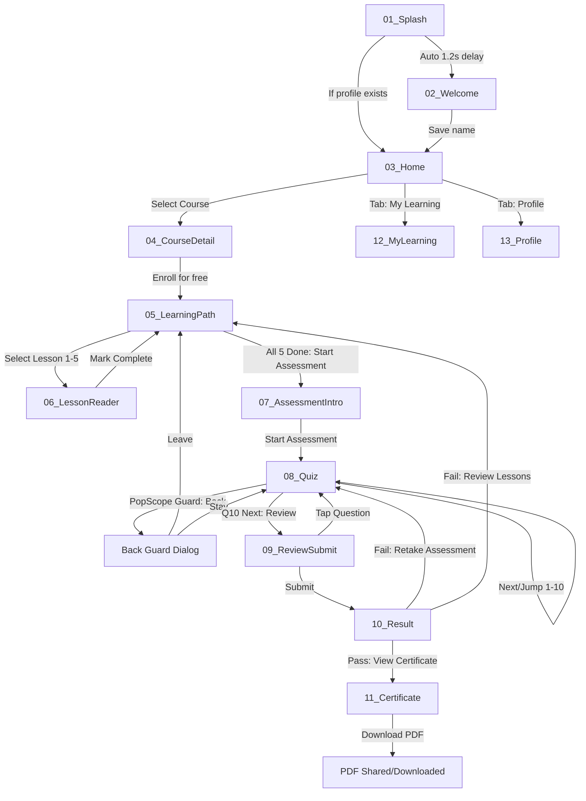

# SkillUp — Figma Design System & Frame-by-Frame Specification

> **Platform:** Flutter Offline Certification Platform  
> **Aesthetic Archetype:** Quiet, Royal, Comfortable (Stationery & Fine Library Aesthetic)  
> **Target Canvases:** Mobile (`390 × 844 px`, iPhone 14/15/16 standard) & Desktop/Tablet (`1280 × 800 px`)  
> **Tokens Source:** [`figma_tokens.json`](file:///Users/sohamahirrao/Desktop/socreate/figma_tokens.json)

---

## 1. Global Design Tokens & Styles

### 1.1 Color Styles (Light & Dark)

| Token Name | Light Value | Dark Value | M3 Role & Usage |
|:---|:---|:---|:---|
| `sys/color/primary` | `#2B3A67` | `#A9BCE9` | Deep Navy Seed, primary buttons, branding |
| `sys/color/on-primary` | `#FFFFFF` | `#142247` | Text/icons on primary elements |
| `sys/color/primary-container` | `#DDE1F5` | `#1F2D54` | Tonal highlights, progress tracks |
| `sys/color/tertiary` | `#B08D57` | `#DFC28D` | Muted Antique Gold, certificate seals, passed badges |
| `sys/color/surface` | `#FAF8F4` | `#12151F` | Warm Ivory (light) / Deep Ink (dark) background |
| `sys/color/surface-variant` | `#F2EFE9` | `#1A1F2E` | Card backgrounds, subtle tonal panels |
| `sys/color/outline` | `#E4E0D8` | `#2A3042` | 1px clean card and divider borders |
| `sys/color/status-success` | `#4F7F6A` | `#78A690` | Soft Sage, passing status, correct answers |
| `sys/color/status-warning` | `#B5654A` | `#E08F75` | Muted Terracotta, failed status, missed questions |

---

### 1.2 Typography Hierarchy

| Style Name | Font Family | Weight | Size | Line Height | Letter Spacing |
|:---|:---|:---|:---|:---|:---|
| `display/large` | Fraunces / Cormorant | SemiBold (600) | `32 px` | `40 px` | `-0.25 px` |
| `headline/large` | Fraunces / Cormorant | SemiBold (600) | `26 px` | `32 px` | `0 px` |
| `headline/medium` | Fraunces / Cormorant | Medium (500) | `22 px` | `28 px` | `0 px` |
| `title/large` | Fraunces / Cormorant | SemiBold (600) | `19 px` | `24 px` | `0 px` |
| `title/medium` | Inter | SemiBold (600) | `16 px` | `22 px` | `+0.15 px` |
| `body/large` | Inter | Regular (400) | `16 px` | `24 px` | `+0.25 px` |
| `body/medium` | Inter | Regular (400) | `14 px` | `20 px` | `+0.25 px` |
| `label/large` | Inter | Medium (500) | `14 px` | `20 px` | `+0.10 px` |
| `label/small` | Inter | Medium (500) | `11 px` | `16 px` | `+0.50 px` |
| `certificate/name` | Fraunces / Serif | Medium Italic (500i) | `30 px` | `38 px` | `+0.50 px` |

---

### 1.3 Core Component Set

1. **`CourseCard`**:
   - Auto-layout: Vertical, Padding: `20px`, Gap: `12px`, Corner radius: `16px`.
   - Stroke: `1px solid sys/color/outline`, Fill: `sys/color/surface-variant`.
   - Elements: Category Overline + Status Chip (row), Title (`headline/medium`), Description (`body/medium`), Info Row (Duration + Difficulty Tag + Arrow).
2. **`StatusChip`**:
   - Variants: `NotStarted`, `InProgress`, `Attempted`, `Completed`.
   - Padding: `4px 10px`, Corner radius: `8px`, Icon: 16px outlined.
3. **`DifficultyTag`**:
   - Variants: `Beginner`, `Intermediate`, `Advanced`.
   - Outline style, uppercase letter spacing, `label/small`.
4. **`OptionTile`**:
   - Auto-layout: Horizontal, Padding: `16px 18px`, Gap: `14px`, Corner radius: `12px`.
   - State: Default (1px outline), Selected (2px primary stroke, tonal primary fill).
   - Tap Target: Min height `54px` (satisfies $\ge 48\text{dp}$).
5. **`QuestionNavStrip`**:
   - Scrollable horizontal row or flex wrap of 36×36px number cells.
   - States: Active (solid primary), Answered (tonal fill with border), Unanswered (plain outline).
6. **`CertificateView`**:
   - Aspect Ratio: 1.414 (A4 Landscape ratio), Ivory fill, double navy border with inner antique gold line.
   - Seals, serif typography, signature line, unique ID watermark.

---

## 2. Frame-by-Frame Mobile Specification (`390 × 844 px`)

### Frame 01: `01_Splash`
- **Dimensions**: `390 × 844 px`
- **Layout**: Centered Auto-Layout (Vertical, gap: `16px`).
- **Background**: `sys/color/surface` (`#FAF8F4`).
- **Layers**:
  - Logo Mark: `64 × 64 px` rounded squircle (`#2B3A67`) with Antique Gold (`#B08D57`) graduation cap icon.
  - App Name: `display/large`, text: *"SkillUp"*.
  - Tagline: `body/medium`, text: *"Certified learning, verified on-device"*.
  - Activity Indicator: M3 Circular Progress, stroke width: `3px`, size: `24px`.
- **Prototype Connection**: After `1200ms` delay $\to$ Navigate to `02_Welcome` (if fresh) or `03_Home` (if enrolled/profile exists).

---

### Frame 02: `02_Welcome`
- **Dimensions**: `390 × 844 px`
- **Layout**: Vertical Auto-Layout, Padding: `32px 24px`, Gap: `24px`.
- **Layers**:
  - Header: Logo mark (`36px`) + Overline `WELCOME TO SKILLUP`.
  - Headline: `headline/large`, *"Start your certification journey."*
  - Body: `body/large`, *"Enroll in curated professional courses, master fundamental concepts, and earn verified on-device certificates."*
  - Form Group:
    - Text Field: *"Full name (as it should appear on your certificate)"*.
    - Helper Note: *"Your name is stored only on this device."*
    - Validation error slot: inline red/terracotta text.
  - CTA Button: `FilledButton` (Full width, height: `52px`), Label: *"Continue"*. Disabled state when name $< 2$ characters.
- **Prototype Connection**: Tap *"Continue"* $\to$ Save profile $\to$ Navigate to `03_Home`.

---

### Frame 03: `03_Home`
- **Dimensions**: `390 × 844 px`
- **Layout**: Vertical Auto-Layout with Sticky Top AppBar & Bottom NavigationBar.
- **Scroll Content** (Padding: `20px`, Gap: `20px`):
  - **Greeting Header**: Row with *"Hello, {Name}"* (`headline/medium`) + Profile Avatar button.
  - **Continue Learning Card** (Conditional, rendered if course in progress):
    - Subtitle: *"CONTINUE LEARNING"*, Course Title, Linear Progress Bar (e.g. `60%`), *"Resume"* button.
  - **Search & Filter Row**:
    - Search Bar: M3 styled with search icon, placeholder *"Search courses or topics..."*.
    - Filter Chips Carousel: `All`, `Mobile`, `Backend`, `Web`, `Security`.
  - **Section Title**: *"Available Certifications"* (`title/large`) + Course Count.
  - **Course List**: 4 `CourseCard` items stacked with `16px` gap.
- **Progress Cue**: Status chips on every card (`Not started`, `In progress`, `Completed ✓`).
- **Bottom Navigation**: M3 `NavigationBar` with 3 items (`Home` [Active], `My Learning`, `Profile`).
- **Prototype Connection**: Tap any `CourseCard` $\to$ Push `04_CourseDetail`.

---

### Frame 04: `04_CourseDetail`
- **Dimensions**: `390 × 844 px`
- **Layout**: Scaffold with `SliverAppBar`, scrollable body, sticky bottom action bar.
- **Header**: Category tag, Course Title (`headline/large`), 1-line summary.
- **Summary Metrics Bar** (Card with 3 columns):
  - Column 1: Duration (`~90 min`)
  - Column 2: Difficulty Tag (`Beginner`)
  - Column 3: Quiz (`10 questions`)
- **Body Sections** (Gap: `24px`):
  - *"About this course"*: Multi-paragraph comprehensive overview.
  - *"What you'll learn"*: 4 bulleted core competencies.
  - *"Course content"*: List of 5 lessons with duration pills (e.g. `Lesson 1: Widget Trees (18 min)`).
  - *"Final assessment"*: Info card highlighting $60\%$ passing requirement and unlimited retakes.
- **Sticky Footer Bar**:
  - Full-width `FilledButton`: *"Enroll for free"* / *"Continue"* / *"View certificate"*.
- **Prototype Connection**: Tap *"Enroll for free"* $\to$ SnackBar *"You're enrolled"* $\to$ Navigate to `05_LearningPath`.

---

### Frame 05: `05_LearningPath`
- **Dimensions**: `390 × 844 px`
- **Top AppBar**: Back button + Course Title.
- **Progress Header**:
  - Large progress text: *"2 of 5 lessons completed"* (`title/medium`).
  - M3 LinearProgressIndicator (`height: 8px`, corner radius: `4px`, `40%` fill).
- **Checklist Content** (Vertical Stack, gap: `12px`):
  - Items 1–2: Completed (`#4F7F6A` check icon, title, read again button).
  - Item 3: Current Recommended (`#2B3A67` highlight border, *"Resume lesson"* badge).
  - Items 4–5: Up Next (subtle greyed icon, openable in any order).
  - Item 6: **Final Assessment Tile**:
    - *Locked State*: Grey lock icon, subtitle *"Complete all 5 lessons to unlock assessment"*, disabled.
    - *Unlocked State*: Gold badge, subtitle *"Ready to certify — 10 questions"*, high-emphasis primary button.
- **Prototype Connection**: Tap any lesson $\to$ Push `06_LessonReader`. Tap unlocked assessment $\to$ Push `07_AssessmentIntro`.

---

### Frame 06: `06_LessonReader`
- **Dimensions**: `390 × 844 px`
- **Top Bar**: Back button, Course Title, reading progress bar on bottom edge (`40%`).
- **Body Auto-Layout** (Padding: `20px`, Gap: `20px`):
  - Meta row: *"Lesson 2 of 5 · 18 min read"*.
  - Lesson Title: `headline/large`.
  - Concept Explanation: 3–4 clean paragraphs, `body/large`, line-height `1.6`.
  - Key Points: Card with 3 bulleted key architectural points.
  - Worked Code Example: Monospace code container (`#1A1F2E` in dark or warm tinted box in light) with copy button.
  - **Real-World Case Study Card**:
    - Accent border, title *"Case Study: Scale at HyperPay"*.
    - Structured sub-sections: *Scenario*, *Problem*, *Approach*, *Outcome*, *Key Takeaway*.
  - Key Takeaways: Summary box.
- **Sticky Footer**:
  - Primary button: *"Mark as complete & continue"*.
  - Text button: *"Previous lesson"*.
- **Prototype Connection**: Tap *"Mark as complete & continue"* $\to$ Save progress $\to$ Return to `05_LearningPath` (or next lesson).

---

### Frame 07: `07_AssessmentIntro`
- **Dimensions**: `390 × 844 px`
- **Layout**: Centered calm card layout.
- **Content**:
  - Overline: *"OFFICIAL ASSESSMENT"*.
  - Title: *"Final Knowledge Certification"*.
  - Subtitle: *"Demonstrate applied mastery to receive your verified digital certificate."*.
  - Rules Grid (4 cards):
    - `10 Questions` (scenario-based).
    - `60% Pass Mark` (6 of 10 to qualify).
    - `No Time Limit` (think carefully).
    - `Answer Review` (inspect answers prior to submission).
- **Primary CTA**: *"Start assessment"* (`FilledButton`).
- **Prototype Connection**: Tap *"Start assessment"* $\to$ Push Replacement `08_Quiz`.

---

### Frame 08: `08_Quiz`
- **Dimensions**: `390 × 844 px`
- **Header**:
  - Row: Back guard button (triggers leave dialog) + *"Question 4 of 10"*.
  - Linear Progress Bar (`40%` fill).
- **Question Number Jump Strip**: Horizontal scrollable numbers 1–10. Answered are filled, unanswered outlined.
- **Question Card**:
  - Prompt text (`title/large`): Scenario-based technical question.
  - Optional Hint Button (rendered conditionally when `hint != null`): Tapping reveals an expandable calm hint card.
- **Options List** (4 `OptionTile` components):
  - Large tap targets ($\ge 54\text{px}$). Radio selection indicator, clear readable text.
- **Navigation Footer**:
  - Previous Button (`OutlinedButton`).
  - Next / Review Button (`FilledButton`: labeled *"Next"* for questions 1–9, *"Review answers"* on question 10).
- **Back Guard Modal**: *"Leave assessment? Your answers will be lost."* [Stay / Leave].
- **Prototype Connection**: Tap *"Review answers"* $\to$ Push `09_ReviewSubmit`.

---

### Frame 09: `09_ReviewSubmit`
- **Dimensions**: `390 × 844 px`
- **Header**: Back to Quiz button + Title *"Review your answers"*.
- **Status Banner**: *"Answered 8 of 10 questions"* (with terracotta warning indicator if unanswered).
- **Question Checklist**: 10 rows showing:
  - Question number + truncated prompt.
  - Status badge: *"Answered"* (Sage) or *"Not answered"* (Terracotta).
  - Action link: *"Go to question"* (jumps directly back to that question index).
- **Sticky Footer Action**: *"Submit assessment"* (`FilledButton`).
- **Unanswered Confirmation Dialog**: If submitted with blanks: *"2 questions are unanswered and will be marked incorrect. Submit anyway?"* [Review / Submit anyway].
- **Prototype Connection**: Confirm Submit $\to$ Evaluates instantly $\to$ Push Replacement `10_Result`.

---

### Frame 10: `10_Result`
- **Dimensions**: `390 × 844 px`
- **Header**: Calm celebratory header (Pass) or supportive encouraging header (Fail).
- **Score Card**:
  - Large Score Display: *"8 / 10"* (`display/large`).
  - Percentage: *"80%"* (`title/large`).
  - Badge: Soft Sage *"PASSED"* with checkmark, or Soft Terracotta *"NOT PASSED — RETRY AVAILABLE"*.
  - Pass mark reminder: *"Pass mark is 60% (6/10). Best score: 8/10"*.
- **Answer Review Section** (Expandable Accordion):
  - All 10 questions listed with:
    - Learner's choice.
    - Correct answer.
    - Null-safe explanation block explaining why the answer is correct.
- **Bottom Actions**:
  - **Pass State**: Primary *"View certificate"*, Secondary *"Back to Home"*.
  - **Fail State**: Primary *"Retake assessment"* (generates fresh randomized 10-question set), Secondary *"Review lessons"*.
- **Prototype Connection**: Tap *"View certificate"* $\to$ Push `11_Certificate`.

---

### Frame 11: `11_Certificate`
- **Dimensions**: `390 × 844 px` (scrollable vertical preview)
- **Top Bar**: Back button + Title *"Official Certificate"*.
- **Certificate Canvas** (Card rendering identical to PDF layout):
  - Background: Warm Ivory (`#FAF8F4`).
  - Border: Double Navy (`#2B3A67`) outline with Antique Gold (`#B08D57`) inner inset line.
  - Wordmark: *"SKILLUP"* + Decorative Gold Emblem/Seal.
  - Subtitle: *"Certificate of Completion"*.
  - Recipient: *"This is to certify that"* $\to$ `{Learner Name}` (Fraunces Serif Italic, `28px`, fitted without overflow).
  - Body: *"has successfully completed all requirements and passed the comprehensive assessment for"* $\to$ `{Course Title}`.
  - Metrics: *"Score: 8/10 (80%) — Verified On-Device"*.
  - Bottom Row: Issue Date, Vector Seal, Signature line *"SkillUp Certification Board"*.
  - Certificate ID: `SKL-FLU-2026-X8K2` (small caps monospace).
- **Actions Bar** (Vertical Stack):
  - Primary Button: *"Download PDF"* (generates vector A4 landscape PDF).
  - Secondary Row: *"Share Certificate"* + *"Print"*.
- **Guard State**: If opened without passing $\to$ Friendly *"Certificate not available yet"* state with direct button to assessment.

---

### Frame 12: `12_MyLearning`
- **Dimensions**: `390 × 844 px`
- **Top Bar**: Title *"My Learning"*.
- **Tab Bar** (M3 TabBar):
  - Tab 1: *"In Progress"* (shows courses with progress percentage and *"Continue"* link).
  - Tab 2: *"Completed"* (shows passed courses with score pill, date issued, *"View"* and *"Download PDF"* buttons).
- **Empty States**: Calm illustration + *"No courses in progress"* / *"No certificates earned yet"*.

---

### Frame 13: `13_Profile`
- **Dimensions**: `390 × 844 px`
- **Header**: Avatar with learner initials + Current Name.
- **Settings List**:
  - **Edit Name Card**:
    - Input field with inline regex validation.
    - Explanatory note: *"Existing certificates keep the name they were issued with."*
    - Save Name button.
  - **Appearance Card**:
    - Theme Selector Segmented Button: `System` / `Light` / `Dark`.
  - **Data & Storage Card**:
    - *"Reset all progress"* (destyled warning button).
    - Triggers modal dialog: *"Reset all course progress, enrollments, and quiz results? Your name will be retained."* [Cancel / Reset].
  - **About Card**:
    - Version `2.0.0`, 100% on-device certification engine, offline-first.

---

## 3. Desktop / Tablet Specification (`1280 × 800 px`)

### Grid & Responsive Breakpoints
- **Breakpoint Rules**:
  - Compact: $< 600\text{ px}$ (single column, full width).
  - Medium: $600\text{–}1000\text{ px}$ (2 columns for catalog, max reading width $680\text{ px}$).
  - Expanded: $> 1000\text{ px}$ (3 columns for catalog, centered containers max $1100\text{ px}$).

### Frame 14: `Desktop_Home` (`1280 × 800 px`)
- **Navigation**: Top AppBar with branded logo, search bar, navigation links (`Home`, `My Learning`, `Profile`), and theme toggle icon.
- **Main Container**: Max-width `1100 px`, centered with `auto` margins.
- **Hero / Continue Banner**: 2-column split card (Continue Learning progress on left, overall stats on right).
- **Course Catalog**: Responsive 3-column GridView (`crossAxisCount: 3`, gap: `24 px`).
- **Cards**: Rich cards with hover elevation transitions.

### Frame 15: `Desktop_LessonReader` (`1280 × 800 px`)
- **Reading Container**: Fixed centered container with max width `720 px`.
- **Side Nav / TOC**: Left sticky rail showing lesson 1–5 progress checklist.
- **Typography**: Scaled for desk viewing (`body/large` line height `1.7`), code blocks styled with high-contrast copy button.

### Frame 16: `Desktop_Certificate` (`1280 × 800 px`)
- **Certificate Canvas**: Centered true A4 landscape representation (`842 × 595 pt` proportion) surrounded by calm ivory workspace and subtle drop shadow (`blur: 32px`).
- **Side Control Drawer**: Download PDF, Print, Share buttons prominently stacked to the right.

---

## 4. Complete Interactive Prototype Flow Matrix

---

## 5. Screen-by-Screen Progress Cues Audit

| Screen | Progress Cue Mechanism | Visual Treatment |
|:---|:---|:---|
| **03 Home** | Course status badges on catalog cards | Status chips: `Not started`, `In progress`, `Completed ✓` |
| **03 Home** | Continue learning banner | Dynamic linear progress bar with active course percentage |
| **04 Course Detail** | Sticky button status + lesson check marks | Displays enrolled/in-progress/completed status dynamically |
| **05 Learning Path** | Header progress summary | *"X of 5 lessons completed"* + linear progress bar |
| **05 Learning Path** | Lesson checklist states | Checkmarked (`Completed`), border highlight (`Current`), lock (`Assessment`) |
| **06 Lesson Reader** | AppBar bottom track | Dynamic reading scroll percentage indicator (`0%` to `100%`) |
| **08 Quiz** | Question count + progress track | *"Question X of 10"* + linear progress bar |
| **08 Quiz** | Question jump strip | 10 interactive pills: filled (answered), outlined (unanswered) |
| **09 Review** | Answered summary counter | *"Answered X of 10"* with warning badges for incomplete questions |
| **10 Result** | Instant score ratio & percentage | *"8 / 10 (80%)"* + Soft Sage `PASSED` badge |
| **11 Certificate** | Official certification badge | Unique Certificate ID, pass score stamp, vector seal |
| **12 My Learning** | Dual tab progress tracking | In-progress percentage bars & earned certificates archive |
| **13 Profile** | Global account status | Stored name verification, reset progress options |
